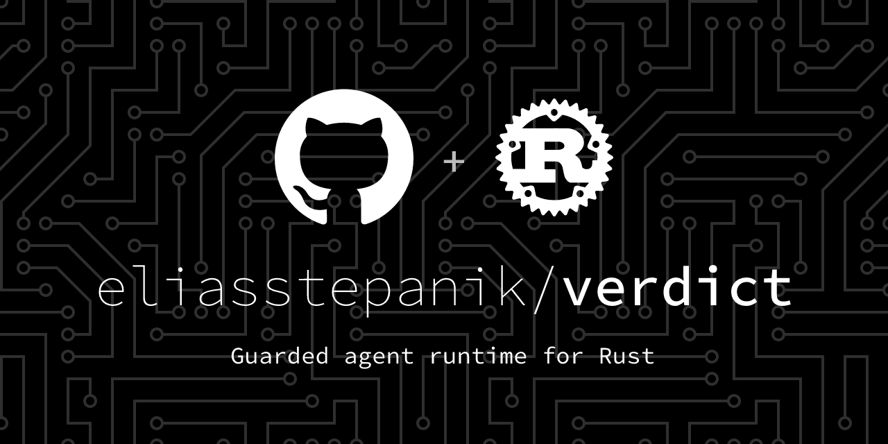

verdict

**A Rust framework for building agents that actually complete their work through code-enforced structure, guarded execution, and composable pipelines.**



[](https://www.rust-lang.org/)
[](LICENSE)
[]()

## How It Works

```
User Task Input
      │
      ▼
┌─────────────────────────────────────────────────────┐
│                     Pipeline                        │
│                                                     │
│  Step 1: Generate Code                              │
│  ┌──────────────────────────────────────────────┐   │
│  │ guard_in:  Guard::None  ✓                    │   │
│  │ action:    LlmCall { "write hello world" }   │   │
│  │ guard_out: Guard::ValidRustSyntax            │   │
│  │ verdict:   Automated(Guard::ValidRustSyntax) │   │
│  └──────────────────────────────────────────────┘   │
│         │ ✅ Guard passes → proceed                │
│         ▼                                           │
│  Step 2: Run Tests (LoopUntil)                      │
│  ┌──────────────────────────────────────────────┐   │
│  │ body:      ToolCall { "cargo test" }         │   │
│  │ condition: Guard::TestsPass                  │   │
│  │ max_iter:  10                                │   │
│  │ on_fail:   DelegateAgent("debugger")         │   │
│  └──────────────────────────────────────────────┘   │
│         │ ✅ Tests pass → proceed                   │
│         ▼                                           │
│  Step 3: User Review                                │
│  ┌──────────────────────────────────────────────┐   │
│  │ action:  UserInput { "Approve this diff?" }  │   │
│  │ verdict: UserApproval                        │   │
│  └──────────────────────────────────────────────┘   │
│         │ ✅ Approved → pipeline succeeds           │
└─────────────────────────────────────────────────────┘
      │
      ▼
  PipelineResult { success: true, cost: $0.002, ... }
  AuditLog [GuardPass, LlmCall, ToolCall, UserApproval]
```

Every guard is **enforced in code** — not just hoped for in a prompt.

---

## Overview

**Verdict is an embeddable Rust library** — not a standalone application or CLI tool. It's designed to be added as a dependency to your Rust project to build autonomous agents that can be **trusted** to complete complex tasks through hard, verifiable guarantees—not soft prompts and hopes.

Traditional agent frameworks are built around LLM calls + tool definitions. Verdict is different:

- **Guards**: Hard conditions (not soft suggestions) that check preconditions, postconditions, and loop invariants
- **Pipelines**: DAG structures of steps, each with its own guard-driven verdict and scoped tool access
- **Verdicts**: Automated or user-approval gates that decide whether a step succeeded and should proceed
- **Agents**: Reusable agent objects with their own pipelines, tools, skills, and policies—can delegate to each other
- **Registry**: Central coordination for agents, tools (built-in, MCP, local Rust functions), and skills
- **Budget tracking**: Cost control, token limits, and rate limiting built in from the start
- **Evaluation**: Test-driven agent improvement via suites that automatically validate agent quality
- **Self-improvement**: Agents can propose patches to themselves, but only after strict guards and user approval
- **Audit logging**: Full trace of every step, tool call, decision, and cost for compliance and debugging

Verdict runs on **9 phases of evolution**, each phase unlocking new capabilities:

| Phase | Theme | Features |
|-------|-------|----------|
| **1** | Core Pipeline & Guards | Pipeline execution, Guard evaluation, basic Verdicts |
| **2** | Tool Registry & Audit | Tool trait, built-in tools, audit logging, cost tracking |
| **3** | MCP Integration | MCP server support, tool discovery, namespaced tool calls |
| **4** | Agent Delegation | AgentRegistry, DelegateAgent action, delegation policy |
| **5** | Skills | SkillRegistry, Skill definitions, UseSkill action, built-in skills |
| **6** | Built-in Agents | 6 specialist agents (planner, coder, reviewer, debugger, reflector, orchestrator) |
| **7** | Safety & Production | InjectionScanner, SecretScanner, enhanced guards, deployment patterns |
| **8** | Self-Improvement | EvaluationSuite, SelfUpdateEngine, agent versioning & promotion |
| **9** | Advanced Execution | Plugin system, HotReload, RemoteAgent |

---

## Features

### Core Execution
- ✅ **Pipeline execution** with DAG support and parallel steps
- ✅ **Guard-driven safety** (pre-conditions, post-conditions, loop invariants)
- ✅ **Verdict gates** for automated or user-approval-based step progression
- ✅ **Conditional branching** via `Guard` composition (`AllOf`, `AnyOf`, `Not`)
- ✅ **Loop control** with `LoopUntil` and iteration failure modes

### Agents & Delegation
- ✅ **Agent registry** for centralized agent management
- ✅ **Agent delegation** with depth control, allowlists, and policy inheritance
- ✅ **Agent versioning** for self-improvement tracking
- ✅ **Scoped tool inheritance** (agent → pipeline → step → skill)

### Tools & Resources
- ✅ **Tool registry** (built-in, MCP, local functions, CLI)
- ✅ **MCP (Model Context Protocol)** server integration
- ✅ **Local Rust function tools** via `FunctionTool`
- ✅ **Tool scoping** (ReadOnly, ReadWrite, Allow-list, Deny-list, Intersection, Union)
- ✅ **Tool audit logging** with full call tracing

### Skills & Knowledge
- ✅ **Skill registry** with reusable capabilities
- ✅ **Built-in skills**: rust_debugging, code_review, api_design, test_writing, refactoring
- ✅ **Skill mode selection** (PromptOnly, Pipeline, Auto)
- ✅ **Skill examples & evaluation** for quality assurance

### Safety & Control
- ✅ **Budget tracking** (cost, tokens, rate limits)
- ✅ **Injection detection** (prompt injection & secret detection)
- ✅ **Permission management** (filesystem isolation, network policies)
- ✅ **Workspace isolation** (temp dirs, sandboxing, per-task separation)
- ✅ **Extensive guard library** (50+ guard types covering syntax, output, files, security, delegation)

### Evaluation & Self-Improvement
- ✅ **Evaluation suites** for testing agent quality
- ✅ **Self-update engine** with patching & validation
- ✅ **Automated improvement loops** with guard-gated promotion
- ✅ **Cost-benefit analysis** for self-updates

### Monitoring & Debugging
- ✅ **Comprehensive audit logging** (JSON-serializable events)
- ✅ **Pipeline tracing** with step results and timing
- ✅ **Hot-reload support** for live agent updates

---

## Installation

Add to your `Cargo.toml`:

```toml
[dependencies]
verdict = "0.1"
tokio = { version = "1", features = ["rt", "rt-multi-thread", "macros"] }
serde_json = "1"
```

---

## Quick Start

Here's a simple pipeline with a coder and reviewer agent delegating to each other:

```rust
use verdict::prelude::*;
use serde_json::json;

#[tokio::main]
async fn main() -> Result<(), Box<dyn std::error::Error>> {
    // Create a simple pipeline step
    let coding_step = AgentStep {
        name: "write_code".into(),
        guard_in: Guard::None,
        action: StepAction::LlmCall {
            system: "You are a code generator.".into(),
            user: "Write a hello world function in Rust.".into(),
            model: None,
        },
        guard_out: Guard::ValidRustSyntax,
        verdict: Verdict::Automated(Guard::ValidRustSyntax),
        tools: ToolSet::ReadOnly,
        injection_protection: InjectionProtection::Strict,
        output_schema: None,
    };

    let pipeline = Pipeline {
        name: "simple_code_gen".into(),
        steps: vec![coding_step],
        on_failure: FailureMode::Abort,
        max_retries: 1,
    };

    // Create a runner and execute
    let mut runner = PipelineRunner::new();
    let result = runner.run(&pipeline, json!({})).await?;

    println!("Pipeline result: {:?}", result);
    println!("Output: {}", result.output.raw);

    Ok(())
}
```

This example:
1. Defines a single `AgentStep` with an `LlmCall` action
2. Sets up guards: input must pass `Guard::None` (always), output must be `Guard::ValidRustSyntax`
3. Creates a `Pipeline` containing the step
4. Runs it with a `PipelineRunner`
5. Checks the result

---

## Using a Real LLM Provider

Verdict ships with a built-in OpenAI-compatible provider. Any endpoint that speaks the OpenAI chat completions API works — OpenAI, Anthropic via proxy, Ollama, LM Studio, etc.

### From environment variables

```rust
use verdict::prelude::*;

// Reads OPENAI_API_KEY (required), OPENAI_BASE_URL, OPENAI_MODEL from env
let client = LlmClient::from_env()?;
let mut runner = PipelineRunner::new().with_llm_client(Arc::new(client));
```

### Hardcoded provider

```rust
use verdict::prelude::*;
use verdict::llm::OpenAiCompatibleProvider;
use std::sync::Arc;

let provider = OpenAiCompatibleProvider::new(
    "https://api.openai.com".into(),  // base URL (without /v1)
    "sk-your-api-key".into(),
    "gpt-4o".into(),                  // default model
);
let client = Arc::new(LlmClient::new(Arc::new(provider)));
let mut runner = PipelineRunner::new().with_llm_client(client);
```

### Per-step model routing

Each `LlmCall` step can override the model — useful for routing easy tasks to a fast
cheap model and hard tasks to a more capable one:

```rust
use verdict::action::ProviderSpec;

AgentStep {
    action: StepAction::LlmCall {
        system: "You are an expert analyst.".into(),
        user: "Analyse this in depth.".into(),
        model: Some(ProviderSpec {
            model: "claude-opus-4-7".into(),
            provider: "openai-compatible".into(),
        }),
    },
    // ...
}
```

---

## Setting Up in Your Application

Here's a complete step-by-step guide for using Verdict as a library in a real Rust project.

### Step 1: Add to `Cargo.toml`

```toml
[dependencies]
verdict = { path = "./verdict" }  # or from crates.io once published
tokio = { version = "1", features = ["rt", "rt-multi-thread", "macros"] }
serde_json = "1"
```

### Step 2: Create Your Main with Async Runtime

```rust
use verdict::prelude::*;
use serde_json::json;
use std::sync::Arc;

#[tokio::main]
async fn main() -> Result<(), Box<dyn std::error::Error>> {
    // Set up logging (optional)
    env_logger::init();

    // Create registries
    let tool_registry = Arc::new(ToolRegistry::with_builtins());
    let agent_registry = Arc::new(AgentRegistry::new());
    let skill_registry = Arc::new(SkillRegistry::new());

    // Register agents
    agent_registry.register(coder_agent());
    agent_registry.register(reviewer_agent());
    agent_registry.register(debugger_agent());
    agent_registry.register(planner_agent());
    agent_registry.register(reflector_agent());

    // Create a pipeline
    let my_pipeline = Pipeline {
        name: "test_pipeline".into(),
        steps: vec![
            AgentStep {
                name: "generate_code".into(),
                guard_in: Guard::None,
                action: StepAction::LlmCall {
                    system: "You are a code generator.".into(),
                    user: "Write a function that adds two numbers.".into(),
                    model: None,
                },
                guard_out: Guard::NonEmptyOutput,
                verdict: Verdict::Automated(Guard::NonEmptyOutput),
                tools: ToolSet::ReadOnly,
                injection_protection: InjectionProtection::Strict,
                output_schema: None,
            },
        ],
        on_failure: FailureMode::Abort,
        max_retries: 1,
    };

    // Create a runner
    let mut runner = PipelineRunner::with_registries(
        tool_registry.clone(),
        agent_registry.clone(),
    ).with_skill_registry(skill_registry);

    // Get the planner agent
    let agent = planner_agent();

    // Run the pipeline
    let result = runner.run(
        &my_pipeline,
        &agent,
        json!({}),
    ).await?;

    // Inspect results
    println!("Pipeline completed: {:?}", result.success);
    println!("Output: {}", result.output.raw);
    println!("Cost: ${:.4}", result.cost);

    // Access audit log
    for entry in runner.audit_log.entries() {
        println!("Audit: {:?}", entry.event);
    }

    Ok(())
}
```

### Step 3: Handle Pipeline Results

The `PipelineResult` contains:

```rust
pub struct PipelineResult {
    pub success: bool,
    pub output: StepOutput,
    pub cost: f64,
    pub step_results: HashMap<String, StepResult>,
}
```

Check the result and take action:

```rust
match runner.run(&pipeline, &agent, input).await {
    Ok(result) => {
        if result.success {
            println!("Pipeline succeeded. Output:\n{}", result.output.raw);
        } else {
            println!("Pipeline failed");
        }
        println!("Total cost: ${:.4}", result.cost);
    }
    Err(e) => {
        eprintln!("Pipeline error: {:?}", e);
    }
}
```

---

---

## Core Concepts

### Pipeline & AgentStep
A **Pipeline** is a DAG of **AgentStep**s to be executed sequentially (or with controlled concurrency). Each step has:
- **name**: unique identifier
- **guard_in**: precondition (must pass before execution)
- **action**: what to do (LlmCall, ToolCall, DelegateAgent, LoopUntil, Custom, UserInput, UseSkill, SubPipeline, RemoteAgent)
- **guard_out**: postcondition (output must satisfy)
- **verdict**: decides success (Automated or UserApproval)
- **tools**: scoped tool allowlist
- **injection_protection**: input sanitization level

### Guard & GuardEngine
A **Guard** is a verifiable condition. The **GuardEngine** evaluates guards against step context. Guards include:
- Output validation: `ValidJson`, `ValidRustSyntax`, `MatchesSchema`, `MaxTokens`
- File checks: `FileExists`, `FileContains`, `FormatPass`, `LintPass`, `Compiles`, `TestsPass`
- Security: `NoSecretsInOutput`, `NoPermissionEscalation`, `DiffTouchesAllowedPaths`
- Delegation: `MaxDelegationDepth`, `OnlyAllowedAgentsUsed`
- Composition: `AllOf`, `AnyOf`, `Not`

### Verdict & VerdictEngine
A **Verdict** decides whether a step succeeded. It can be:
- **Automated**: succeeded if a guard passes (e.g., `Verdict::Automated(Guard::TestsPass)`)
- **UserApproval**: wait for human confirmation with optional diff display
- **AllOf** / **AnyOf**: multiple verdicts that must all/any pass

### PipelineRunner
The **PipelineRunner** orchestrates pipeline execution. It:
- Tracks agent, tool, and skill registries
- Manages budget, audit logs, and traces
- Evaluates guards before/after each step
- Handles delegation recursively
- Supports hot-reload of agents/tools via plugins

### StepAction (Overview)
Actions determine what a step does:
- **LlmCall**: talk to an LLM
- **ToolCall**: call a registered tool
- **DelegateAgent**: recursively run another agent
- **SubPipeline**: inline execute a sub-pipeline
- **LoopUntil**: repeat action until guard passes (max iterations)
- **Custom**: arbitrary async Rust closure
- **UserInput**: prompt the user
- **UseSkill**: run/inject a reusable skill
- **RemoteAgent**: call a remote agent (distributed execution)

### AgentRegistry & ToolRegistry
**Registries** are central hubs:
- **AgentRegistry**: maps agent names to `Agent` objects (for delegation)
- **ToolRegistry**: maps tool names to `Tool` trait objects (built-in, MCP, local, external)
- **SkillRegistry**: maps skill names to `Skill` definitions

### AuditLog
Comprehensive logging of every event:
- Step execution start/end
- Guard evaluation pass/fail
- Tool calls with args & results
- Delegation paths
- Cost tracking
- User approvals
- All JSON-serializable for compliance

### EvaluationSuite
Tests that verify agent quality:
- **EvaluationCase**: (input, expected output/schema/guard)
- **EvaluationRunner**: runs cases and scores results
- **Minimum score threshold** for promotion to production

### SelfUpdateEngine
Enables agents to improve themselves:
- Reflect on past failures/costs
- Propose patches to pipeline/guards/tools
- Validate patches via compilation, tests, evaluation
- Require user approval (configurable)
- Version the agent on successful update

### Plugin System
Extend Verdict without recompiling:
- **Plugin trait**: load at runtime
- **PluginRegistry**: manage lifecycle
- **HotReloadHandle**: live update agents/tools

---

## Guards Reference

| Guard | Purpose |
|-------|---------|
| `None` | Always passes |
| `ValidJson` | Output is valid JSON |
| `ValidRustSyntax` | Output is syntactically valid Rust |
| `ValidToml` / `ValidYaml` | Config file validation |
| `MatchesSchema(Value)` | JSON Schema validation |
| `Compiles` | Rust code compiles (`cargo check`) |
| `TestsPass` | Tests pass (auto-detected runner) |
| `TestsPassWith(TestRunner)` | Tests pass with explicit runner |
| `LintPass` | Linting passes |
| `FormatPass` | Code formatting correct |
| `FileExists(path)` | File exists |
| `FileContains { path, pattern }` | File contains regex pattern |
| `MaxTokens(n)` | Output ≤ n tokens (cl100k_base) |
| `MaxOutputBytes(n)` | Output ≤ n bytes |
| `MaxLines(n)` | Output ≤ n lines |
| `TimeoutSeconds(s)` | Command finishes within s seconds |
| `NonEmptyOutput` | Output is not empty |
| `NoSecretsInOutput` | No API keys or secrets detected |
| `NoPermissionEscalation` | No privilege escalation |
| `DiffTouchesAllowedPaths(vec)` | Modified files in allowlist |
| `DiffDoesNotTouchForbiddenPaths(vec)` | Modified files not in denylist |
| `StepPassed(name)` | Previous step with name passed |
| `UserApproved(name)` | User approved step with name |
| `AllOf(vec)` | All guards must pass |
| `AnyOf(vec)` | Any guard must pass |
| `Not(box)` | Negate guard |

See `src/guard.rs` for the full list (50+ variants).

---

## StepAction Reference

| Variant | Purpose |
|---------|---------|
| `LlmCall { system, user, model }` | Call an LLM with system & user prompts |
| `ToolCall { tool, args }` | Call a registered tool by name |
| `DelegateAgent { agent, input, policy, ... }` | Recursively run another agent |
| `SubPipeline(pipeline)` | Inline execute a sub-pipeline |
| `LoopUntil { body, condition, max_iterations, ... }` | Repeat action until condition met |
| `UseSkill { skill, input, mode }` | Run or inject a reusable skill |
| `UserInput { prompt, schema }` | Prompt user for input |
| `Custom(fn)` | Call arbitrary async Rust closure |
| `RemoteAgent { url, agent, input, ... }` | Call a distributed agent via HTTP |

---

## Phase Roadmap

All 10 phases are **complete** ✅:

1. ✅ **Phase 1: Core Pipeline & Guards** — Basic execution, guard evaluation
2. ✅ **Phase 2: Tool Registry & Audit** — Tool trait, built-in tools, audit logging
3. ✅ **Phase 3: MCP Integration** — Model Context Protocol server support
4. ✅ **Phase 4: Agent Delegation** — AgentRegistry, delegation policy, recursive execution
5. ✅ **Phase 5: Skills** — SkillRegistry, reusable capabilities, built-in skills
6. ✅ **Phase 6: Built-in Agents** — 6 specialist agents (planner, coder, reviewer, debugger, reflector, orchestrator)
7. ✅ **Phase 7: Safety & Production** — Injection detection, secret detection, enhanced guards
8. ✅ **Phase 8: Self-Improvement** — EvaluationSuite, SelfUpdateEngine, agent versioning
9. ✅ **Phase 9: Advanced Execution** — Plugin system, hot-reload, remote agents
10. ✅ **Phase 10: Stub Completion** — Real LLM provider, HTTP tool, MCP JSON-RPC, TOML/YAML guard parsing

---

## Example: TDD Loop

Here's a real-world example using `LoopUntil` to implement test-driven development:

```rust
use verdict::prelude::*;
use serde_json::json;

let tdd_loop = StepAction::LoopUntil {
    body: Box::new(StepAction::SubPipeline(Pipeline {
        name: "tdd_iteration".into(),
        steps: vec![
            AgentStep {
                name: "write_or_fix_code".into(),
                guard_in: Guard::None,
                action: StepAction::LlmCall {
                    system: "Fix failing tests.".into(),
                    user: "Failing tests:\n{test_output}".into(),
                    model: None,
                },
                guard_out: Guard::ValidRustSyntax,
                verdict: Verdict::Automated(Guard::ValidRustSyntax),
                tools: ToolSet::Allow(vec!["fs.write".into()]),
                injection_protection: InjectionProtection::Strict,
                output_schema: None,
            },
            AgentStep {
                name: "run_tests".into(),
                guard_in: Guard::None,
                action: StepAction::ToolCall {
                    tool: "shell.cargo_test".into(),
                    args: json!({}),
                },
                guard_out: Guard::NonEmptyOutput,
                verdict: Verdict::Automated(Guard::NonEmptyOutput),
                tools: ToolSet::Allow(vec!["shell.cargo_test".into()]),
                injection_protection: InjectionProtection::Strict,
                output_schema: None,
            },
        ],
        on_failure: FailureMode::Abort,
        max_retries: 0,
    })),
    condition: Guard::TestsPass,
    max_iterations: 10,
    on_iteration_failure: IterationFailureMode::Retry,
};
```

This loop:
- Repeats up to 10 times
- Each iteration: (1) LLM writes/fixes code, (2) runs tests
- Exits when `Guard::TestsPass` succeeds
- On iteration failure, retries immediately
- Prevents infinite loops via `max_iterations`

---

## Built-in Agents

Verdict ships with 6 specialist agents (defined in `src/agents/`):

| Agent | Role | Default Tools |
|-------|------|----------------|
| **planner** | Breaks down tasks into steps | ReadOnly |
| **coder** | Implements code changes | ReadWrite |
| **reviewer** | Reviews code quality | ReadOnly |
| **debugger** | Fixes compilation/test failures | ReadWrite |
| **reflector** | Analyzes agent performance | ReadOnly |
| **orchestrator** | Coordinates multi-agent workflows | ReadOnly |

Each agent has its own pipeline, policy, and allowed tool scope. Agents can delegate to each other (with depth limits).

---

## Built-in Skills

Verdict includes 5 built-in skills (in `src/skills/builtin/`):

- **rust_debugging**: Fix Rust compile/test failures
- **code_review**: Review code for quality & security
- **api_design**: Design clean APIs
- **test_writing**: Generate comprehensive tests
- **refactoring**: Refactor code safely

Skills can be injected into LLM prompts or run as sub-pipelines.

---

## Testing

Run all tests:

```bash
cargo test
```

Run a specific phase:

```bash
cargo test --test phase1
cargo test --test phase2
# ... up to phase9
```

Each phase file tests the corresponding set of features in isolation.

---

## Contributing

Verdict is designed to be extended. You can:

1. Add new guards to `src/guard.rs`
2. Add new built-in tools to `src/tools/`
3. Register custom agents in `AgentRegistry`
4. Create custom skills in `src/skills/`
5. Write plugins implementing the `Plugin` trait

See the architecture document for detailed design decisions.

---

## License

MIT (see LICENSE file for details)

---

## Examples

Verdict comes with example programs in the `examples/` directory, runnable via `cargo run --example <name>`:

| Example | Demonstrates |
|---------|-------------|
| `new_project` | Create a new project structure using Verdict |
| `dev_pipeline` | Set up and run a development pipeline with guards and verdicts |
| `check_pipeline` | Validation pipeline with detailed guard checks |
| `run_agent` | Run a built-in agent (planner, coder, reviewer, etc.) through a pipeline |

Run any example:

```bash
cargo run --example new_project
cargo run --example dev_pipeline
cargo run --example check_pipeline
cargo run --example run_agent
```

Each example demonstrates core Verdict concepts:
- **Pipeline structure** and step definitions
- **Guard enforcement** and verdict gates
- **Agent delegation** patterns
- **Tool registry** integration
- **Audit logging** and tracing

These examples are part of the Verdict library itself and show how to use Verdict as an embeddable Rust dependency in your own application.

---

## References

- **Architecture**: Read `architecture.md` for the full design and extended examples
- **How-to guide**: Read `how_to.md` for a field-by-field reference of every `AgentStep` option
- **API Docs**: `cargo doc --open` to browse generated Rust docs
- **Tests**: See `tests/phase*.rs` for working examples of all features

---

**Built with Rust 🦀 | Designed for safety, auditability, and self-improvement.**
